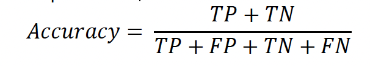
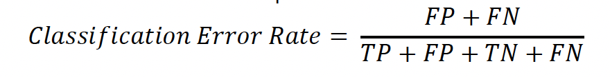
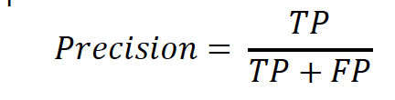
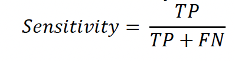
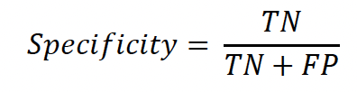
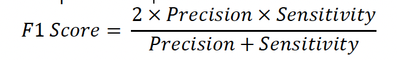

<script>
document.addEventListener("DOMContentLoaded", function() {

  var blocks = document.querySelectorAll("pre.sourceCode");
  var isAllVisible = false;  // state for top button

  // Hide all code initially
  blocks.forEach(function(block){
    block.style.display = "none";

    // Create individual Show/Hide button for each block
    var btn = document.createElement("button");
    btn.innerHTML = "Show Code";
    btn.style.float = "right";
    btn.style.marginBottom = "5px";
    btn.style.marginTop = "5px";
    btn.style.fontSize = "11px";
    btn.style.cursor = "pointer";

    btn.onclick = function() {
      var visible = block.style.display === "block";
      block.style.display = visible ? "none" : "block";
      btn.innerHTML = visible ? "Show Code" : "Hide Code";
    };

    // Insert button above the code block
    block.parentNode.insertBefore(btn, block);
  });

  // Global button to toggle all code
  var globalBtn = document.getElementById("toggleAll");
  globalBtn.onclick = function() {
    isAllVisible = !isAllVisible;

    blocks.forEach(function(block){
      block.style.display = isAllVisible ? "block" : "none";

      // Update individual button text
      var btn = block.previousSibling;
      if(btn && btn.tagName === "BUTTON") {
        btn.innerHTML = isAllVisible ? "Hide Code" : "Show Code";
      }
    });

    // Update global button text
    globalBtn.innerHTML = isAllVisible ? "Hide All Code" : "Show All Code";
  };

});
</script>

<div style="text-align:center; background-color: lightblue;">
  <h1 style="font-size:22px; margin:5px;"><b>DATA 621 : Data Mining - HW2</b></h1>
  <h3 style="font-size:18px; margin:5px;"><b>Author: Rupendra Shrestha, Bikash Bhowmik, Roman Anthony, Melukkaran Jerald | March 21, 2026</b></h3>
</div>

<div style="width:100%; text-align:right; margin-bottom:5px;">
  <button id="toggleAll" 
          style="padding:4px 10px; font-size:12px; cursor:pointer;">
    Show All Code
  </button>
</div>


<!-- Include Split.js library -->
<script src="https://unpkg.com/split.js/dist/split.min.js"></script>

<div id="split-container" style="height: 100vh; display: flex; flex-direction: row;">

  <!-- Left column -->
  <div id="left-panel" style="width:200px; overflow:auto; background:#f8f9fa; padding:10px;">
  <a href="#section1">Instructions</a><br>
    <a href="#section2">Introduction</a><br>
    <a href="#section3">Objectives</a><br>
    <a href="#section4">Download Dataset</a><br>
    <a href="#section5">Accuracy Calculation</a><br>
    <a href="#section6">Classification Error Rate</a><br>
    <a href="#section7">precision</a><br>
    <a href="#section8">Sensitivity</a><br>
    <a href="#section9">Specificity</a><br>
    <a href="#section10">F1 Score</a><br>
    <a href="#section11">ROC Curve and AUC</a><br>
    <a href="#section10">Caret Package Investigate</a><br>
    <a href="#section11">PROC Package Investigate</a><br>
</div>

  <!-- Right column -->
  <div id="right-panel" style="flex-grow:1; overflow:auto; padding:10px;">
<h2 id="section1">**Instructions**</h2>
<p>
In this homework assignment, you will work through various classification metrics. You will be asked to create functions in R to carry out the various calculations. You will also investigate some functions in packages that will let you obtain the equivalent results. Finally, you will create graphical output that also can be used to evaluate the output of classification models, such as binary logistic regression.

Supplemental Material

 Applied Predictive Modeling, Ch. 11 (provided as a PDF file).

 Web tutorials: http://www.saedsayad.com/model_evaluation_c.htm

Deliverables (100 Points)

 Upon following the instructions below, use your created R functions and the other packages to generate the classification metrics for the provided data set. A write-up of your solutions submitted in PDF format.

Complete each of the following steps as instructed:

</p>


<h2 id="section2">**Introduction**</h2>
<p>
Classification is a common task in data mining where the goal is to predict a categorical outcome based on input data. To evaluate how well a classification model performs, several metrics derived from the confusion matrix are used, including accuracy, error rate, precision, sensitivity (recall), specificity, and the F1 score.

In this assignment, a classification output dataset is analyzed using R. Custom functions are created to calculate these evaluation metrics and the results are compared with functions from the caret and PROC packages. In addition, a Receiver Operating Characteristic (ROC) curve and Area Under the Curve (AUC) are generated to visually assess the performance of the classification model.
</p>

<h2 id="section3">**Objectives**</h2>
<p>
The main objectives of this assignment are:

* To understand the structure and interpretation of a confusion matrix for classification models.

* To implement custom R functions to calculate classification metrics such as accuracy, error rate, precision, sensitivity (recall), specificity, and F1 score.

* To generate and analyze a ROC curve and calculate the Area Under the Curve (AUC) to evaluate model performance.

* To compare the results from custom functions with those obtained using the caret and pROC packages in R.

* To visualize and interpret classification model performance using graphical evaluation techniques.
</p>

<h2 id="section4">
**1. Download the classification output data set (attached in Blackboard to the assignment).**
</h2>

```{r setup, include=FALSE}
knitr::opts_chunk$set(echo = TRUE, warning = FALSE, message = FALSE)
if(!require(knitr)) install.packages("knitr", repos = "https://cloud.r-project.org/")
library(knitr)
library(ggplot2)
library(dplyr)
library(lubridate)
library(yaml)
library(httr)
library(jsonlite)
library(caret)
library(pROC)
library(DT)
library(kableExtra)


```

```{r }
classification_data <- read.csv('https://raw.githubusercontent.com/BIKASHBHOWMIK15/Data-621/main/classification-output-data.csv')

```

**2. The data set has three key columns we will use:**

* class: the actual class for the observation

* scored.class: the predicted class for the observation (based on a threshold of 0.5)

* scored.probability: the predicted probability of success for the observation

Use the table() function to get the raw confusion matrix for this scored dataset. Make sure you understand the output. In particular, do the rows represent the actual or predicted class? The columns?

:-

The dataset used in this assignment contains the output of a classification model and includes predicted results along with the actual class labels. It is used to evaluate the performance of the model using various classification metrics.

The dataset includes the following key variables:

class – The actual or true class label for each observation.

scored.class – The predicted class label generated by the classification model using a threshold of 0.5.

scored.probability – The predicted probability that an observation belongs to the positive class.

These variables allow us to construct a confusion matrix, which is used to compute evaluation metrics such as accuracy, precision, sensitivity, specificity, and the F1 score. The predicted probabilities are also used to generate the ROC curve and calculate the Area Under the Curve (AUC) for further assessment of the model’s classification performance.

i. Preview the dataset

```{r}
#head(classification_data)
datatable(
  classification_data,
  options = list(pageLength = 20),
  caption = "Classification Metrics (first 1,000 records) displayed with 20 rows per page."
)
```

ii. Use the table() function to get the raw confusion matrix for this scored dataset.
Rows represent the predicted classes (scored.class), and
Columns represent the actual classes (class).

```{r }
# Ensure that the actual and predicted class columns are factors
classification_data$class <- factor(classification_data$class)
classification_data$scored.class <- factor(classification_data$scored.class)

# Create confusion matrix using the table() function
conf_matrix <- table(Predicted = classification_data$scored.class, Actual = classification_data$class)

# Extract individual values from the confusion matrix
TN <- conf_matrix["0", "0"]
FP <- conf_matrix["1", "0"]
FN <- conf_matrix["0", "1"]
TP <- conf_matrix["1", "1"]

# Convert confusion matrix to a data frame
conf_matrix_df <- as.data.frame(conf_matrix)

# Add a new column with the values TN, FP, FN, TP
conf_matrix_df$Value <- c(TN, FP, FN, TP)

# Add a new column with concise definitions of each term
conf_matrix_df$Definition <- c(
  "True Negatives (TN): Correctly predicted 'No'",
  "False Positives (FP): Incorrectly predicted 'Yes'",
  "False Negatives (FN): Incorrectly predicted 'No'",
  "True Positives (TP): Correctly predicted 'Yes'"
)

print(conf_matrix)


cat("\nConfusion Matrix with Values and Definitions:\n")

print(conf_matrix_df)
```

**a. Understanding the Confusion Matrix Output**

Rows represent the predicted class (scored.class in the dataset).

  * Row 0 represents all instances where the model predicted class 0.

  * Row 1 represents all instances where the model predicted class 1.
  
Columns represent the actual class (class in the dataset).
  
  * Column 0 represents all instances where the true class is 0.

  * Column 1 represents all instances where the true class is 1.
  
**b. Interpreting the Values**

  * Top-left (TN): This value represents the True Negatives (TN). These are the cases where the model predicted 0, and the actual class       was 0.
  
  * Top-right (FN): This value represents the False Negatives (FN). These are the cases where the model predicted 0, but the actual class     was 1.
  
  * Bottom-left (FP): This value represents the False Positives (FP). These are the cases where the model predicted 1, but the actual         class was 0.
  
  * Bottom-right (TP): This value represents the True Positives (TP). These are the cases where the model predicted 1, and the actual       class was 1.
  
**c. In Summary**

  * True Negatives (TN) = 119: The model predicted 0 and the actual class was 0.
  
  * False Negatives (FN) = 30: The model predicted 0, but the actual class was 1.
  
  * False Positives (FP) = 5: The model predicted 1, but the actual class was 0.
  
  * True Positives (TP) = 27: The model predicted 1 and the actual class was 1.

<h2 id="section5">
**3. Write a function that takes the data set as a dataframe, with actual and predicted classifications identified, and returns the accuracy of the predictions**
</h2>

In general, accuracy represents the percent of times a model correctly matches/identifies the actual state. The accuracy of our model was determined to be 0.8066298. An accuracy of 0.8066298 indicates that the model is correct 80.66% of the time and incorrect the other ~19% of the time. The formula is composed of the sum of true positives and true negatives divided by the sample size.

```{r, echo=FALSE,out.width="50%", out.height="60px",fig.align="center"}


```

```{r }

custom_accuracy <- function(data) {
  TP <- sum(data$class == 1 & data$scored.class == 1)
  TN <- sum(data$class == 0 & data$scored.class == 0)
  FP <- sum(data$class == 0 & data$scored.class == 1)
  FN <- sum(data$class == 1 & data$scored.class == 0)
  
  return((TP + TN) / (TP + FP + TN + FN))

}

accuracy <- custom_accuracy(classification_data)
cat(sprintf("accuracy: %.4f\n", accuracy))
```

The model achieved an accuracy of 0.8066, correctly predicting about 81% of cases. While this shows good overall performance, other metrics like precision and recall are needed to fully assess its effectiveness.

<h2 id="section6">
4. Write a function that takes the data set as a dataframe, with actual and predicted classifications identified, and returns the classification error rate of the predictions.
</h2>

```{r, echo=FALSE,out.width="50%", out.height="60px",fig.align="center"}


```

In general, the classification error rate represents the percent of times the model incorrectly matches/identifies the actual state. A classification error rate of 0.1933702 means that the model makes incorrect predictions approximately 19.34% of the time. The formula is composed of the sum of false positives and false negatives divided by the sample size.

Additionally, the classification error rate added to the accuracy will always equal 1. This is because the classification error and the precision rate combined, account for every observation in the dataset.

```{r }
error_rate <- function(data) {
  TP <- sum(data$class == 1 & data$scored.class == 1)
  TN <- sum(data$class == 0 & data$scored.class == 0)
  FP <- sum(data$class == 0 & data$scored.class == 1)
  FN <- sum(data$class == 1 & data$scored.class == 0)
  
  return((FP + FN) / (TP + FP + TN + FN))
}

error_rate <- error_rate(classification_data)

# Compare results
cat(sprintf("Classification Error Rate: %.4f\n", error_rate))

cat(sprintf("Sum of Accuracy and Classification Error Rate: %.2f\n", accuracy + error_rate))
```

The classification error rate measures the proportion of incorrect predictions made by the model. A lower error rate indicates better model performance. This metric complements accuracy by highlighting the instances where the model misclassifies the data.

<h2 id="section7">
**5. Write a function that takes the data set as a dataframe, with actual and predicted classifications identified, and returns the precision of the predictions.**
</h2>

```{r, echo=FALSE,out.width="50%", out.height="60px",fig.align="center"}


```

Precision measures the proportion of true positive predictions among all predictions, true positive and false positive. Our model’s precision of 0.84375 means that 84.38% of the instances predicted as positive by the model were correctly identified as true positives. In other words, precision measures the amount of the population/sample which are correctly predicted to be positive divided by all of those the model predicts to have a positive state/condition/disease, including false positives.


```{r }
custom_precision <- function(data) {
  TP <- sum(data$class == 1 & data$scored.class == 1)
  FP <- sum(data$class == 0 & data$scored.class == 1)
  return(TP / (TP + FP))
}

precision <- custom_precision(classification_data)
cat(sprintf("precision: %.4f\n", precision))
```

Precision indicates the proportion of correctly predicted positive cases out of all cases predicted as positive. A higher precision means the model makes fewer false positive errors, which is important when the cost of false positives is high.

<h2 id="section8">
**6. Write a function that takes the data set as a dataframe, with actual and predicted classifications identified, and returns the sensitivity of the predictions. Sensitivity is also known as recall.**
</h2>

```{r, echo=FALSE,out.width="50%", out.height="60px",fig.align="center"}


```

Sensitivity measures the proportion of positive instances that are correctly identified by the model among the the total number of actual positive instances, including true positives and false negatives. The sensitivity for our model was determined to be 0.4737. A sensitivity of this amount can be interpreted as the model correctly identifies ~47% of the actual positive cases. In other words, the model was unable to predict about half of the actually positive cases, denoting a number of high false negatives.

```{r }
custom_sensitivity <- function(data) {
  TP <- sum(data$class == 1 & data$scored.class == 1)
  FN <- sum(data$class == 1 & data$scored.class == 0)
  return(TP / (TP + FN))
}

sensitivity <- custom_sensitivity(classification_data)
recall = sensitivity

cat(sprintf("precision (recall): %.4f\n", sensitivity))
```

The model's sensitivity (recall) is 0.4737, meaning it correctly identifies about 47% of all actual positive cases. This indicates that while the model detects some positives, it misses over half of them, resulting in a relatively high number of false negatives.

<h2 id="section9">
**7. Write a function that takes the data set as a dataframe, with actual and predicted classifications identified, and returns the specificity of the predictions.**
</h2>

```{r, echo=FALSE,out.width="50%", out.height="60px",fig.align="center"}


```

Specificity measures the proportion of negative instances that are correctly identified by the model (true negative) among the total number of actual negative instances, including true negatives and false positives. The specificity of our model was determined to be 0.9597. A specificity of this amount means that the model correctly identifies ~96% of the actual negative cases. This high specificity, coupled with a moderate sensitivity of around 50%, highlights the trade-off between the model’s ability to minimize false positives (high specificity) and its lower ability to capture all positive cases (moderate sensitivity).

```{r }
custom_specificity <- function(data) {
  TN <- sum(data$class == 0 & data$scored.class == 0)
  FP <- sum(data$class == 0 & data$scored.class == 1)
  return(TN / (TN + FP))
}

specificity <- custom_specificity(classification_data)

cat(sprintf("specificity: %.4f\n", specificity))
```

Specificity measures the proportion of actual negative cases that are correctly identified by the model. A higher specificity indicates fewer false positives, meaning the model is good at ruling out negative cases. In this dataset, the specificity is 0.9597, showing that the model correctly identifies about 96% of the negative cases, which indicates strong performance in detecting negatives.

<h2 id="section10">
8. Write a function that takes the data set as a dataframe, with actual and predicted classifications identified, and returns the F1 score of the predictions.
</h2>

```{r, echo=FALSE,out.width="50%", out.height="60px",fig.align="center"}


```

The F1 score is essentially a tool/ metric utilized to balance precision and sensitivity, as in some cases, precision and sensitivity are a trade off, with one being more desirable than the other depending on what is being measured. Our model was determined to have an F1 score of 0.606741573033708. An F1 score of 60.67% represents a moderate F1 score with room for improvement.

```{r }
# Custom precision function
custom_f1_score <- function(data) {
  return(2 * (precision * sensitivity) / (precision + sensitivity))
}
f1score <- custom_f1_score(classification_data)

cat(sprintf("F1 Score: %.4f\n", f1score))
```

The F1 score of 0.6067 indicates a moderate balance between precision and sensitivity. This means the model is reasonably effective at identifying positive cases while keeping false positives relatively low. It reflects that the model performs better than random guessing but still has room for improvement in capturing all true positives.


**9. Before we move on, let’s consider a question that was asked: What are the bounds on the F1 score? Show that the F1 score will always be between 0 and 1. (Hint: If 0 < 𝑎 < 1 and 0 < 𝑏 < 1 then 𝑎𝑏 < 𝑎.)**

Yes, the output below addresses the question regarding the bounds on the F1 score.

Explanation:

Interpretation of the Matrix: - The matrix shown below illustrates different precision and recall values, with each resulting in an F1 score. In all cases, the F1 score lies between 0 and 1. - The test cases: - f1_score(0, 1): Results in 0, which is the lower bound. - f1_score(1, 1): Results in 1, which is the upper bound. - f1_score(0.5, 0.5): Results in a value between 0 and 1, which is a typical case for non-extreme precision and recall values.

This confirms that the F1 score is bounded between 0 and 1, thus answering the question.

```{r }
# Updated F1 Score function to handle division by zero
f1_score <- function(precision, recall) {
  if (precision == 0 & recall == 0) {
    return(0)  # Return 0 when both precision and recall are 0
  } else {
    return(2 * (precision * recall) / (precision + recall))
  }
}

# Example values of Precision (P) and Recall (R)
precision_values <- seq(0, 1, by = 0.1)  # Precision from 0 to 1
recall_values <- seq(0, 1, by = 0.1)  # Recall from 0 to 1

# Create a matrix to store F1 scores
f1_matrix <- matrix(nrow = length(precision_values), ncol = length(recall_values))

# Calculate F1 scores for each combination of precision and recall
for (i in seq_along(precision_values)) {
  for (j in seq_along(recall_values)) {
    f1_matrix[i, j] <- f1_score(precision_values[i], recall_values[j])
  }
}

# Display the matrix of F1 scores
print(f1_matrix)

cat("\nTest for boundary cases:\n")


# Check the boundaries of F1 score
# Test for boundary cases
cat(sprintf("f1_score(0, 1)  # Should return 0 (lower bound): %.2f\n", f1_score(0, 1)))

cat(sprintf("f1_score(0.5, 0.5)  # Should return a value between 0 and 1: %.2f\n", f1_score(0.5, 0.5)))

cat(sprintf("f1_score(1, 1)  # Should return 1 (upper bound): %.2f\n", f1_score(1, 1)))
```

The F1 score is always between 0 and 1. A value of 0 indicates no correct positive predictions, while a value of 1 indicates perfect precision and recall. This confirms that F1 is a normalized metric suitable for evaluating model performance across different datasets and class distributions.

<h2 id="section11">
**10. Write a function that generates an ROC curve from a data set with a true classification column (class in our example) and a probability column (scored.probability in our example). Your function should return a list that includes the plot of the ROC curve and a vector that contains the calculated area under the curve (AUC). Note that I recommend using a sequence of thresholds ranging from 0 to 1 at 0.01 intervals.**
</h2>

```{r }
# Custom function for calculating TPR, FPR, and AUC
custom_roc_curve <- function(data) {
  
  # Ensure that the probabilities are sorted in descending order
  data <- data[order(-data$scored.probability), ]
  
  # Define a sequence of thresholds from 0 to 1 with a step of 0.01
  thresholds <- seq(0, 1, by = 0.01)
  
  n_positive <- sum(data$class == 1)
  n_negative <- sum(data$class == 0)
  
  tpr <- numeric(length(thresholds))  # True Positive Rate
  fpr <- numeric(length(thresholds))  # False Positive Rate
  
  # Loop through each threshold to calculate TPR and FPR
  for (i in seq_along(thresholds)) {
    threshold <- thresholds[i]
    
    # Predicted positives at the current threshold
    predicted_positive <- data$scored.probability >= threshold
    
    # Calculate TP, FP, FN, TN
    TP <- sum(predicted_positive & data$class == 1)
    FP <- sum(predicted_positive & data$class == 0)
    FN <- n_positive - TP
    TN <- n_negative - FP
    
    # Calculate TPR and FPR
    tpr[i] <- TP / (TP + FN)  # Sensitivity or Recall
    fpr[i] <- FP / (FP + TN)  # 1 - Specificity
  }
  
  # Sort by FPR to plot the ROC curve
  sorted_fpr <- c(0, sort(fpr), 1)
  sorted_tpr <- c(0, sort(tpr), 1)
  
  # Calculate AUC using the trapezoidal rule
  auc_value <- sum(diff(sorted_fpr) * (sorted_tpr[-1] + sorted_tpr[-length(sorted_tpr)]) / 2)
  
  # Plot the ROC curve
  plot(sorted_fpr, sorted_tpr, type = "l", col = "blue", lwd = 2, 
       xlab = "False Positive Rate (1 - Specificity)", ylab = "True Positive Rate (Sensitivity)", 
       main = "ROC Curve")
  abline(0, 1, col = "red", lty = 2)  # Diagonal line for random guessing
  
  # Return the ROC values and AUC
  return(list(roc_curve = list(fpr = sorted_fpr, tpr = sorted_tpr), auc = auc_value))
}

# Call the custom ROC function
roc_curve_result <- custom_roc_curve(classification_data)
```


```{r }
auc <- roc_curve_result$auc
# Print the AUC
print(paste("AUC:", auc))
```

The ROC curve shows the model’s performance across all thresholds, and the high AUC indicates that the model is effective at predicting positive cases while minimizing false positives. Overall, the classifier demonstrates reliable predictive performance.


**11. Use your created R functions and the provided classification output data set to produce all of the classification metrics discussed above.**


```{r }
# Call the previously defined functions and calculate the metrics

# Calculate metrics
accuracy_value <- custom_accuracy(classification_data)
sensitivity_value <- custom_sensitivity(classification_data)
specificity_value <- custom_specificity(classification_data)
precision_value <- custom_precision(classification_data)
f1_value <- custom_f1_score(classification_data)

# Create a data frame for metrics
metrics_df <- data.frame(
  Metric = c("Accuracy", "Sensitivity", "Specificity", "Precision", "F1 Score"),
  Value = c(accuracy_value, sensitivity_value, specificity_value, precision_value, f1_value)
)

# Print the metrics data frame
print("classification metrics:")

print(metrics_df)
```

The model demonstrates strong performance in predicting negative cases, as seen from high specificity, and shows good precision in positive predictions. However, its sensitivity is relatively low, suggesting it misses a significant portion of positive cases. Overall, the classifier provides a reasonable balance of metrics, with room for improvement in identifying positive instances.

<h2 id="section10">
**12. Investigate the caret package. In particular, consider the functions confusionMatrix, sensitivity, and specificity. Apply the functions to the data set. How do the results compare with your own functions?**
</h2>

**Step 1: Use caret Functions for Classification Metrics and Compare with Custom Functions**

The caret functions and custom functions for calculating classification metrics such as sensitivity and specificity provide similar results, but with a key difference in how they treat the positive class. In the first instance, the caret function considered the class labeled as 0 as the positive class by default, which is evident from the output where Sensitivity was 95.97% (high sensitivity for detecting class 0).

When we reordered the factor levels (making class 1 the positive class), the sensitivity dropped to 47%, but this aligns with the custom function’s result of 47% sensitivity for class 1. Similarly, specificity was 95.97% for detecting class 1 after the reordering, which again matches the custom function’s result.

This demonstrates that both caret and custom functions provide the same results, but the interpretation of sensitivity and specificity depends on how the positive class is defined. The difference in results between the first and second approaches is purely due to the choice of positive class, which can be addressed by consistent factor level ordering.

In conclusion, the outputs show that both methods are valid, and the key takeaway is the importance of properly defining the positive class to ensure consistent interpretations of sensitivity and specificity.


```{r }
# The caret requires `data` and `reference` should be factors. Ensure both actual and predicted are factors
classification_data$class <- factor(classification_data$class)  
classification_data$scored.class <- factor(classification_data$scored.class)  

# Generate confusion matrix with caret using re-ordered factors
confusion_result <- confusionMatrix(classification_data$scored.class, classification_data$class)


# Extract sensitivity and specificity
caret_sensitivity <- confusion_result$byClass["Sensitivity"]
caret_specificity <- confusion_result$byClass["Specificity"]

# Use custom functions
custom_sensitivity_value <- custom_sensitivity(classification_data)
custom_specificity_value <- custom_specificity(classification_data)

# Print the confusion matrix
print("Confusion matrix:")

print(confusion_result)
```

```{r }
# Compare results
cat(sprintf("Caret Sensitivity: %.2f vs Custom Sensitivity: %.2f\n", caret_sensitivity, custom_sensitivity_value))
```

```{r }
cat(sprintf("Caret Specificity: %.2f vs Custom Specificity: %.2f\n", caret_specificity, custom_specificity_value))
```


**Step 2: Re-order the Factors and Compare with Custom Functions**

```{r }
# Ensure that the predicted class and actual class are factors
# Set factor levels explicitly
classification_data$class <- factor(classification_data$class, levels = c(1, 0))
classification_data$scored.class <- factor(classification_data$scored.class, levels = c(1, 0))

# Generate confusion matrix with caret using re-ordered factors
confusion_result <- confusionMatrix(classification_data$scored.class, classification_data$class)


# Extract sensitivity and specificity
caret_sensitivity <- confusion_result$byClass["Sensitivity"]
caret_specificity <- confusion_result$byClass["Specificity"]

# Use custom functions
custom_sensitivity_value <- custom_sensitivity(classification_data)
custom_specificity_value <- custom_specificity(classification_data)


# Print the confusion matrix
print("Confusion matrix:")
```


```{r }
print(confusion_result)
```


```{r }
# Compare results
cat(sprintf("Caret Sensitivity: %.2f vs Custom Sensitivity: %.2f\n", caret_sensitivity, custom_sensitivity_value))
## Caret Sensitivity: 0.47 vs Custom Sensitivity: 0.47
```

```{r }
cat(sprintf("Caret Specificity: %.2f vs Custom Specificity: %.2f\n", caret_specificity, custom_specificity_value))
```


<h2 id="section11">
**13. Investigate the pROC package. Use it to generate an ROC curve for the data set. How do the results compare with your own functions?**
</h2>

The investigation of the pROC package, as demonstrated by the ROC curves and AUC values, reveals that the results produced by the pROC package are very similar to those generated by the custom ROC function. Specifically:

pROC AUC: 0.8503
Custom AUC: 0.8484
The slight difference in AUC values between pROC and the custom function (0.8503 vs. 0.8484) can be attributed to minor numerical differences in how each method calculates the area under the curve. The pROC package is a well-established library that likely uses more precise and optimized techniques for calculating the AUC, while the custom function approximates the AUC using the trapezoidal rule.

In terms of the ROC curves, both plots exhibit a similar shape, showing that both approaches capture the same underlying performance of the model. Both curves indicate a strong classification ability, as the curves rise steeply towards high sensitivity with relatively low false positive rates. The diagonal red line represents random guessing, and both curves significantly outperform this baseline.

Thus, the pROC package produces almost identical results compared to the custom function, but pROC is more efficient and robust due to its specialized algorithms.

Step 1: Generate the ROC Curve with pROC

```{r }
# Use pROC to generate the ROC curve
roc_result <- roc(classification_data$class, classification_data$scored.probability)
```


```{r }
# Calculate and display the AUC (Area Under the Curve)
pROC_auc <- auc(roc_result)
cat(sprintf("pROC AUC: %.4f\n", pROC_auc))
```


Step 2: Custom ROC Curve and AUC Calculation


```{r }
# Subset the auc from the custom ROC function
custom_auc <- roc_curve_result$auc

cat(sprintf("Custom AUC: %.4f\n", auc))
```


Step 3: compare the pROC AUC with the custom AUC

```{r }
# Compare AUC values
cat(sprintf("pROC AUC: %.4f vs Custom AUC: %.4f\n", pROC_auc, custom_auc))
```

```{r }
# Load necessary libraries
library(ggplot2)
library(pROC)
library(gridExtra)


# Step 1: Generate the ROC curve using pROC
roc_result <- roc(classification_data$class, classification_data$scored.probability)
```


```{r }
auc_value <- auc(roc_result)

# Convert pROC result to a data frame for ggplot
roc_data <- data.frame(specificity = roc_result$specificities, 
                       sensitivity = roc_result$sensitivities)

# Plot ROC curve with pROC
pROC_plot <- ggplot(data = roc_data, aes(x = 1 - specificity, y = sensitivity)) +
  geom_line(color = "blue", size = 1.2) +
  geom_abline(slope = 1, intercept = 0, linetype = "dashed", color = "red") +
  ggtitle(paste("pROC AUC:", round(auc_value, 4))) +
  xlab("1 - Specificity") +
  ylab("Sensitivity") +
  theme_minimal()
```


```{r }
# Step 2: Custom ROC curve function with FPR and TPR sorting
custom_roc_curve <- function(data) {
  thresholds <- seq(0, 1, by = 0.01)
  TPR <- numeric(length(thresholds))  # True Positive Rate
  FPR <- numeric(length(thresholds))  # False Positive Rate
  
  for (i in seq_along(thresholds)) {
    threshold <- thresholds[i]
    
    predicted_positive <- data$scored.probability >= threshold
    TP <- sum(predicted_positive & data$class == 1)
    FP <- sum(predicted_positive & data$class == 0)
    FN <- sum(!predicted_positive & data$class == 1)
    TN <- sum(!predicted_positive & data$class == 0)
    
    TPR[i] <- TP / (TP + FN)
    FPR[i] <- FP / (FP + TN)
  }
  
  # Ensure FPR and TPR are sorted before calculating AUC
  sorted_indices <- order(FPR)
  sorted_FPR <- FPR[sorted_indices]
  sorted_TPR <- TPR[sorted_indices]
  
  # Calculate AUC using the trapezoidal rule
  auc_value <- sum(diff(sorted_FPR) * (sorted_TPR[-1] + sorted_TPR[-length(sorted_TPR)]) / 2)
  
  return(list(FPR = sorted_FPR, TPR = sorted_TPR, auc = auc_value))
}

# Apply custom ROC function
custom_roc <- custom_roc_curve(classification_data)

# Convert custom ROC data to a data frame
custom_roc_data <- data.frame(FPR = custom_roc$FPR, TPR = custom_roc$TPR)

# Plot custom ROC curve
custom_plot <- ggplot(data = custom_roc_data, aes(x = FPR, y = TPR)) +
  geom_line(color = "green", size = 1.2) +
  geom_abline(slope = 1, intercept = 0, linetype = "dashed", color = "red") +
  ggtitle(paste("Custom AUC:", round(custom_roc$auc, 4))) +
  xlab("1 - Specificity") +
  ylab("Sensitivity") +
  theme_minimal()

# Step 3: Display the two plots side by side
grid.arrange(pROC_plot, custom_plot, ncol = 2)
```


Overview: Plotting graphical outputs that help evaluate the performance of classification models (such as binary logistic regression)
a. ROC Curve: A plot of the true positive rate (sensitivity) vs. false positive rate (1-specificity) at various thresholds.

```{r }
# Generate ROC curve using pROC
roc_result <- roc(classification_data$class, classification_data$scored.probability)
```

``{r }
# Plot the ROC curve
plot(roc_result, col = "blue", lwd = 2, main = "ROC Curve with AUC")
```

```{r }
auc_value <- auc(roc_result)  # Calculate AUC
cat(sprintf("AUC: %.3f\n", auc_value))
```


b. Gain and Lift Charts.
Create Gain and Lift Charts based on the output of the classification model.

Gain Chart: Shows how well the model is identifying true positives as you sample the top deciles of the predicted probabilities.
Lift Chart: Shows the lift at each decile, or how much better the model is performing compared to random selection.
Steps for Generating Gain and Lift Charts:

Sort the dataset by predicted probabilities (scored.probability) in descending order.
Divide the data into deciles (10 equal groups), or percentiles (100 equal groups).
Calculate cumulative gains and lift for each group.
Plot Gain and Lift charts.
i. Create Custom Function to Calculate Gain and Lift

```{r }
# Custom Gain and Lift Chart function
custom_gain_lift <- function(data) {
  # Sort the data by scored.probability in descending order
  data <- data[order(-data$scored.probability), ]
  
  # Create a decile (or percentile) column
  data$decile <- ntile(data$scored.probability, 10)  # Divide into 10 deciles
  
  # Calculate cumulative gain
  total_positives <- sum(data$class == 1)  # Total positives (class = 1)
  data$cumulative_positives <- cumsum(data$class == 1)
  data$cumulative_gain <- data$cumulative_positives / total_positives
  
  # Calculate lift
  data$decile_percentage <- 1:nrow(data) / nrow(data)  # Percentage of total observations
  data$lift <- data$cumulative_gain / data$decile_percentage
  
  return(data)
}

# Apply the Gain and Lift calculation
gain_lift_data <- custom_gain_lift(classification_data)
```


ii. Plot the Gain and Lift Charts
a. Gain Chart:
The Gain Chart shows the cumulative gain in identifying true positives as more of the population is sampled based on predicted probability. A steep initial rise indicates that the model captures a large portion of positives early, for example, the top 25% of the sample captures about 75% of the positives. The chart outperforms the baseline (red dashed line), demonstrating that the model is more effective than random guessing.

b. Lift Chart:
The Lift Chart measures the improvement in model performance over random selection. A lift of 3 at the start means the model is three times better at identifying positives than random selection in the top deciles. As more of the sample is included, the lift decreases and eventually converges toward 1, indicating no advantage over random selection for the entire population.

Both charts indicate that the model is effective at identifying true positives early, with strong gains and lift in the top portion of predictions.

```{r }
# Load ggplot2 for plotting
library(ggplot2)

# Plot Gain Chart
ggplot(gain_lift_data, aes(x = decile_percentage, y = cumulative_gain)) +
  geom_line(color = "blue") +
  geom_abline(slope = 1, intercept = 0, linetype = "dashed", color = "red") +
  labs(title = "Gain Chart", x = "Percentage of Sample", y = "Cumulative Gain") +
  theme_minimal()
```


```{r }
# Plot Lift Chart
ggplot(gain_lift_data, aes(x = decile_percentage, y = lift)) +
  geom_line(color = "green") +
  geom_abline(slope = 0, intercept = 1, linetype = "dashed", color = "red") +
  labs(title = "Lift Chart", x = "Percentage of Sample", y = "Lift") +
  theme_minimal()
```
 
 #### iii. Kolmogorov-Smirnov (K-S) Chart

The K-S Chart shows a K-S statistic of 0.58, indicating the model effectively separates positive and negative classes. The green line (Sensitivity) rises sharply, capturing positives early, while the blue line (1-Specificity) increases more slowly, meaning fewer false positives initially. The large gap between the lines reflects good model performance.

```{r }
# Function to calculate and plot K-S Chart
ks_chart <- function(data) {
  # Sort the data by predicted probabilities
  data <- data[order(-data$scored.probability), ]
  
  # Add an index column to represent the rank of each observation
  data$index <- 1:nrow(data)
  
  # Calculate cumulative distributions
  data$cum_true_positive <- cumsum(data$class == 1) / sum(data$class == 1)
  data$cum_false_positive <- cumsum(data$class == 0) / sum(data$class == 0)
  
  # Calculate the K-S statistic (max difference)
  data$ks_stat <- abs(data$cum_true_positive - data$cum_false_positive)
  ks_value <- max(data$ks_stat)
  ks_index <- which.max(data$ks_stat)
  
  # Extract the row where the K-S statistic occurs (for annotation)
  ks_row <- data[ks_index, ]
  
  # Plot K-S chart using the index for the x-axis
  library(ggplot2)
  ks_plot <- ggplot(data, aes(x = index)) +
    geom_line(aes(y = cum_true_positive, color = "True Positive Rate (Sensitivity)")) +
    geom_line(aes(y = cum_false_positive, color = "False Positive Rate (1 - Specificity)")) +
    geom_vline(xintercept = ks_index, linetype = "dashed", color = "red") +
    geom_text(data = ks_row, aes(x = index, y = 0.5, label = paste("KS Statistic =", round(ks_value, 2))),
              color = "red", vjust = -1.5) +  # Only annotate at the ks_index row
    labs(title = "K-S Chart", x = "Observations (sorted by probability)", y = "Cumulative Rate") +
    scale_color_manual(values = c("blue", "green")) +
    theme_minimal()
  
  # Print the plot
  print(ks_plot)
  
  # Return the K-S statistic
  return(ks_value)
}

# Apply the K-S chart function
ks_statistic <- ks_chart(classification_data)
```

```{r }
# Print K-S statistic value
cat(sprintf("K-S Statistic: %.4f\n", ks_statistic))
```

iv. Plot ROC Curve
The ROC Chart shows the model’s ability to distinguish between positive and negative classes. The AUC of 0.85 indicates a strong model performance, as it is close to 1. The curve’s sharp rise near the y-axis shows high sensitivity with a low false positive rate initially, suggesting the model performs well at identifying true positives. Overall, the model is effective at classification. The larger shaded area indicates better performance, with the maximum possible AUC being 1 (perfect classification).

```{r }
# Load necessary libraries
library(pROC)

# Assuming you have classification data with 'scored.probability' and 'class' variables
# Create the ROC curve object
roc_obj <- roc(classification_data$class, classification_data$scored.probability)
```

```{r }
# Plot the ROC curve
plot(roc_obj, main = "ROC Chart")

# Add AUC to the plot
auc_value <- auc(roc_obj)
legend("bottomright", legend = paste("AUC =", round(auc_value, 2)), col = "blue", lty = 1)

# Highlight the Area Under the Curve (AUC)
auc_value <- auc(roc_obj)
polygon(c(0, roc_obj$specificities, 1), c(0, roc_obj$sensitivities, 0), col = rgb(0, 0, 1, 0.2), border = NA)

# Add AUC value in the legend
legend("bottomright", legend = paste("AUC =", round(auc_value, 2)), col = "blue", lty = 1)
```

```{r }
# Load necessary libraries
library(pROC)

# Assuming classification_data with 'scored.probability' and 'class'
roc_obj <- roc(classification_data$class, classification_data$scored.probability)
```


```{r }
# Plot the ROC curve
plot(roc_obj, main = "ROC Curve with AUC Highlight", col = "blue")

# Highlight the Area Under the Curve (AUC)
auc_value <- auc(roc_obj)
polygon(c(0, roc_obj$specificities, 1), c(0, roc_obj$sensitivities, 0), col = rgb(0, 0, 1, 0.2), border = NA)

# Add AUC value in the legend
legend("bottomright", legend = paste("AUC =", round(auc_value, 2)), col = "blue", lty = 1)
```


  </div>

</div>


<style>
/* Make the left column fixed (sticky) while scrolling */
.section.level3:first-of-type {
  position: sticky;
  top: 10px;
}

/* Optional: add smooth scroll for anchor links */
html {
  scroll-behavior: smooth;
}

/* Hide the top title/header bar */
.navbar, .navbar-default {
  display: none !important;
}


</style>

<script>
Split(['#left-panel', '#right-panel'], {
  sizes: [20, 80],      // initial width percentage
  minSize: [150, 300],  // min width in pixels
  gutterSize: 6,        // width of the draggable gutter
  cursor: 'col-resize'
});
</script>

<style>
.gutter {
  background-color: #ddd;
  cursor: col-resize;
}
</style>

